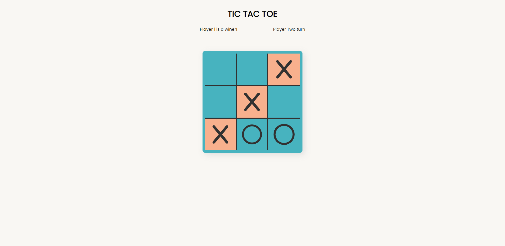

# Tic Tac Toe game

> Live demo [_here_](https://tic-tac-toe-factory.netlify.app/).

## Table of Contents

- [General Info](#general-information)
- [Technologies Used](#technologies-used)
- [Features](#features)
- [Screenshots](#screenshots)
- [Project Status](#project-status)
- [Room for Improvement](#room-for-improvement)
- [Acknowledgements](#acknowledgements)

## General Information

- Simple tic tac toe game
- Made to practice Factory Functions Pattern

## Technologies Used

- Java Script
- Html/css

## Features

List the ready features here:

- Game logic
- UI

## Screenshots

## Project Status

Project is: _in progress_

## Room for Improvement

Room for improvement:

- User interface
- AI

## Acknowledgements

- This is my solution to [_course project_](https://www.theodinproject.com/lessons/node-path-javascript-tic-tac-toe)
